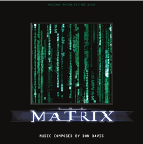
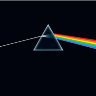
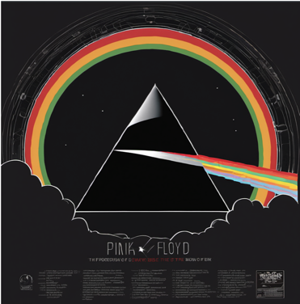
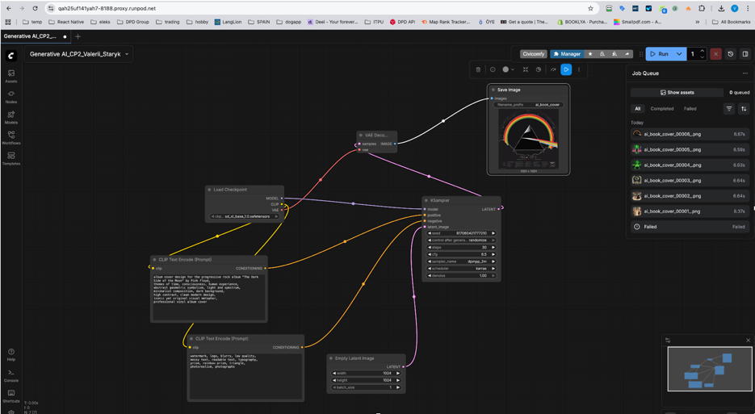

# Generative AI – Capstone Project 2
### Name: Valerii Staryk
### Project: Alternative Media Covers Using Generative AI
### Tool: Stable Diffusion XL (self-hosted)

## Overview
This project explores the use of generative AI to create alternative cover designs for iconic media works. All AI-generated images were produced using a self-hosted ComfyUI instance deployed on RunPod (cloud GPU). The goal was not to recreate existing covers, but to generate original visual interpretations based on themes, mood, and concepts of the original works.
### Original Works
#### Book — 1984 by George Orwell
1984 is an iconic dystopian novel exploring themes of surveillance, control, and loss of individuality. The original cover is widely recognized and serves as conceptual inspiration only.

#### Video — The Matrix (1999)
The Matrix is a landmark science fiction film dealing with simulated reality, control, and human awakening. The original cover is referenced only as a cultural and thematic source.

#### Audio — The Dark Side of the Moon by Pink Floyd
This album is one of the most iconic works in music history, addressing themes of time, consciousness, and the human condition.

### AI-Generated Works
#### AI-Generated Book Cover — 1984

##### Positive prompt:
book cover design for a dystopian novel, themes of surveillance, control, and loss of individuality, symbolic illustration, dramatic cinematic lighting, editorial illustration style, clean layout with space for title, professional publishing cover, high detail
##### Negative prompt:
watermark, logo, blurry, low quality, messy text, readable text, extra letters

#### AI-Generated Video Cover — The Matrix

##### Positive prompt:
movie cover design for the science fiction film "The Matrix", themes of simulated reality, control, and awakening, cyberpunk atmosphere, dark futuristic city, green digital glow, abstract symbolic imagery, cinematic lighting, dramatic contrast, retro futuristic aesthetic, professional DVD cover design, clean composition with space for title
##### Negative prompt:
watermark, logo, blurry, low quality, messy text, readable text, extra letters, faces, portraits, actors, screenshots, movie still, frame from film

#### AI-Generated Audio Cover — The Dark Side of the Moon

##### Positive prompt:
album cover design for the progressive rock album "The Dark Side of the Moon" by Pink Floyd, themes of time, consciousness, human experience, abstract geometric symbolism, light and spectrum, minimalist composition, dark background, high contrast, clean modern design, iconic yet original visual metaphor, professional vinyl album cover
##### Negative prompt:
watermark, logo, blurry, low quality, messy text, readable text, typography, prism, rainbow prism, triangle, photorealism, photographs
## Image Generation Workflow
#### Model: 
Stable Diffusion XL Base 1.0

#### Model link: https://huggingface.co/stabilityai/stable-diffusion-xl-base-1.0
LoRAs / adapters: None


#### Technical settings:
- Steps: 30
- CFG: 6.5
- Sampler: DPM++ 2M
- Scheduler: Karras
- Resolution: 1024 × 1024
- Seed: Random

#### Resources Used
WebUI: ComfyUI
Deployment: Cloud (RunPod)
Hardware: NVIDIA GPU (RunPod cloud instance)
Execution mode: Self-hosted text-to-image generation

## Conclusion
This project demonstrates the use of a self-hosted generative AI pipeline to create original visual interpretations of iconic media works. By focusing on themes and conceptual elements rather than visual replication, the generated covers remain original while still clearly referencing their source material.
